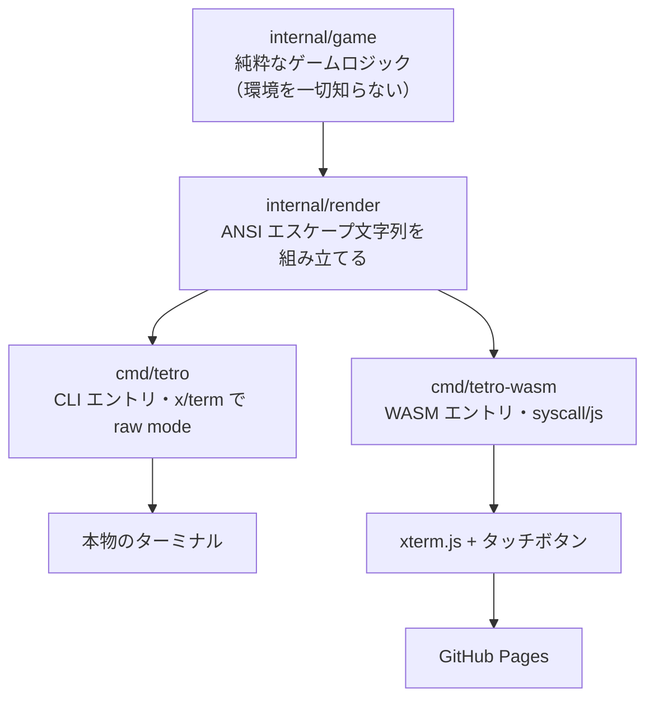

# tetro-term — 開発計画

ターミナルで動く落ち物パズルを Go で書き、同じコアを WebAssembly に載せて
GitHub Pages でも遊べるようにする。**主目的は Go 言語の学習**であり、
ゲームロジックは外部ライブラリに委ねず自分で書く。

## アーキテクチャ



**設計の肝**: コアと表示の境界は「ANSI エスケープ入りの文字列」ただ一つ。
レンダラを CLI 用・ブラウザ用に二重化しないので、以降の作業は
ほぼ全部「Go でゲームを書く」ことに集中できる。

詳細な決定の経緯は `docs/adr/` を参照。用語は `CONTEXT.md` を参照。

## ディレクトリ構成

```
tetro-term/
├── CONTEXT.md          用語集（実装詳細は書かない）
├── PLAN.md             このファイル
├── docs/adr/           覆すのが高くつく決定の記録
├── internal/game/      コア: 盤面・ミノ・落下・消去（環境非依存）
├── internal/render/    ANSI レンダラ: 盤面 → 文字列
├── cmd/tetro/          CLI エントリ
├── cmd/tetro-wasm/     WASM エントリ
└── web/                index.html / main.js / xterm.js / wasm_exec.js
```

## マイルストーン

| | 内容 | 完了時にできること |
| --- | --- | --- |
| **M0** | Go の hello world を WASM 化 → xterm.js に表示 → Pages へデプロイ | **スマホで表示を確認できる** |
| **M1** | コア最小: 盤面・落下・左右移動・単純回転・接地固定・ライン消去 + ANSI レンダラ + CLI | 手元のターミナルで遊べる |
| **M2** | WASM 入口とキー入力ブリッジ | PC のブラウザで遊べる |
| **M3** | タッチ操作ボタン列 | **スマホで遊べる** |
| **M4** | ハードドロップ・ゴースト・ロックディレイ(0.5s) | 操作の手触りが出る |
| **M5** | 7バッグ・ネクスト表示・ホールド | 理不尽さが消える |
| **M6** | SRS キックテーブル投入 | 壁際で正しく回る |
| **M7** | スコア・レベル・落下加速・ゲームオーバー/リスタート | ゲームとして完結 |
| **M8** | ハイスコア永続化（CLI=ファイル / Web=localStorage を注入） | 依存性逆転の実践 |

### M0 を最初に置く理由

「スマホで進捗を確認しながら開発する」という運用を選んだため、
`Go → WASM → xterm.js → Pages → スマホ` の経路が**最初から通っていること**が
開発サイクルの前提条件になった。ゲームが完成してから経路を繋ごうとして詰まると、
それまでの確認手段が丸ごと失われる。技術的な不確実性は M0 で先に潰す。

## 環境メモ

- Go は `~/.local/go-sdk/go`（go1.27.1）。`export PATH="$HOME/.local/go-sdk/go/bin:$PATH"`
- `wasm_exec.js` は `$(go env GOROOT)/lib/wasm/wasm_exec.js` にある。Go のバージョンと
  厳密に対応するので、コピーではなくビルド時に取得する。
- **スマホ確認は push → Actions → Pages 経由**。この WSL は NAT の内側にいて
  開発サーバに外部デバイスから接続できない（過去に失敗記録あり）。

## 制約（実装前に承知しておくこと）

- **キーを離したイベントは取得できない**。端末も xterm.js も keyup 相当を
  ゲームに渡してくれない。したがって押しっぱなしの左右移動（DAS/ARR）は
  OS のキーリピート設定に委ねる。ロックディレイは自前で実装する。
  ただし**これは端末の話に限る**。タッチボタンには離した瞬間が取れるので、
  M3 以降、スマートフォンでの連続移動はブラウザ側のドライバが自分で作っている。
- **公開時に "Tetris" を名乗らない**。ゲーム名と特定の外観は商標であり、
  個人のクローンが削除要請を受けた事例がある。落ち物パズルとして公開する。
- Go の `js/wasm` バイナリは 2MB 前後になる。gzip 転送で 600KB〜1MB 程度。
  許容する。TinyGo でのサイズ削減は「重くて遊べない」と判明してから検討する。
