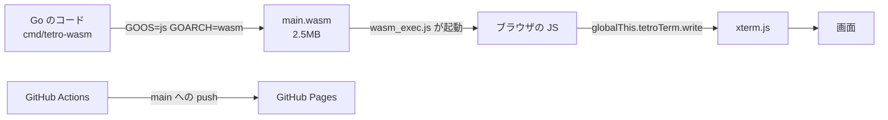

# M0 完了 — 経路の貫通

2026-09-09。GitHub Issue #1 / PR #10, #11。
公開先: https://bubbleshaker.github.io/tetro-term/

## 何をしたか

**ゲームは1行も書いていない。** Go で書いたプログラムがブラウザの中で動き、
ターミナルの画面に文字を出し、それが GitHub Pages 経由でスマホから見える。
その経路だけを最初に通した。

## なぜ最初にこれをやったか

「スマホで進捗を確認しながら開発する」という運用を選んだ時点で、
この経路は**開発サイクルそのものの前提条件**になった。
ゲームを作り込んでから経路を繋ごうとして詰まると、それまでの確認手段が丸ごと失われる。
一番不確実なところを最初に潰す、という判断。

## 理解しておくとよい要点

### 1. Go から見た「ブラウザ」は窓口ひとつだけ

Go 側は `globalThis.tetroTerm` という JS のオブジェクトしか知らない。
`write` と `ready` を呼ぶだけで、DOM もイベントも触らない。
この先ゲームのコアを書くときも、コアはこの窓口の存在すら知らなくてよい。

### 2. WASM は `main` が終わると死ぬ

普通の Go プログラムは `main` が終われば終了でよいが、WASM では
インスタンスごと消えて JS から呼び戻せなくなる。
`<-make(chan struct{})` で永久に待つことで生かしている。
デッドロック検出に引っかからないことは実際に動かして確認した。

### 3. 改行は `\r\n` でなければならない

ターミナルでは `\n` は「1行下がる」だけで、行頭には戻らない。
`\r`（行頭へ戻る）と組み合わせないと、出力が階段状にずれていく。
**この変換をどこでやるかは設計上の要点**で、ADR-0001 に従い
「フレーム文字列を組み立てる側の責務」とした。窓口で変換すると
二重変換で壊れるうえ、CLI 版にも同じ変換を書く羽目になる。

### 4. ビルド成果物はリポジトリに入れない

`main.wasm`（2.5MB）と `wasm_exec.js` はコミットしていない。
前者は履歴が膨れるため、後者は Go のバージョンと厳密に対応するため
（ズレると起動しない）。どちらも GitHub Actions がビルド時に用意する。

## つまずいた点

### CI が必ず落ちていた（レビューで発見）

`//go:build js && wasm` が付いたコードしかないため、ホストの linux で
`go test ./...` を走らせると**対象パッケージが 0 個になり終了コード 1 で落ちる**。
`go` コマンドは「何も見つからなかった」をエラー扱いにする。

`code-review` の Standards 軸と Spec 軸の**両方から独立に同じ指摘**が挙がった。
検査対象を `GOOS=js GOARCH=wasm go vet ./...` に変えて解決した。

### Pages の有効化と最小権限の衝突

`configure-pages` の `enablement: true` は Pages サイトの作成に `pages: write` を要求する。
ビルドジョブを `contents: read` の最小権限にしていたため落ちた。
**権限を緩めるのではなく**、リポジトリ側で Pages を有効化して解決した（PR #11）。

### 手元では画面を確認できない

この WSL の headless Chromium は `requestAnimationFrame` が発火せず、
xterm.js は描画を rAF で回すため**文字が画面に出ない**。
代わりに「Go が xterm へ渡した文字列」をブラウザ内で捕まえて検証した。
詳細は `research/260909-go-wasm-xterm.md`。

## 次

**M1**（Issue #2）: ゲームコアの最小版と ANSI レンダラ。
ここから先はターミナルの中の話で、ブラウザのことは考えなくてよい。
