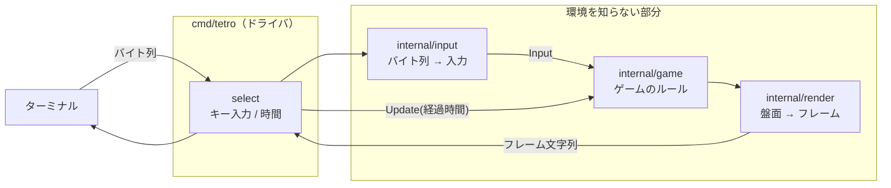

# M1 完了 — ターミナルで遊べるようになった

2026-09-10。GitHub Issue #2 / PR #13, #14, #15。

```sh
go run ./cmd/tetro
```

落ちて・積んで・消えて・詰む、までが動く。スコアもレベルもホールドもまだ無い。

## 何をしたか

M0 で通した経路の上に、実際のゲームを載せた。**4 つの層に分かれていて、
そのうち 3 つは端末もブラウザも知らない。**



M2 でブラウザ版を書くとき、書き直すのは `cmd/tetro` に当たる部分だけになる。
`internal/` の 3 つはそのまま動く。

## 3 本の PR に割ったこと

Issue #2 のチェックリストは 10 項目あり、3 つの層すべてを含んでいた。
1 本の PR にすると差分が大きく、レビューの指摘も一度に大量に来る。

| PR | 範囲 | その時点で確定すること |
| --- | --- | --- |
| #13 | `internal/game` | 画面には何も出ないが、**ルールの正しさはテストで確定する** |
| #14 | `internal/render` | フレーム文字列が出せる |
| #15 | `internal/input` + `cmd/tetro` | 遊べる |

順に依存しているので並行はできないが、**バグが出たときの捜索範囲が層で切れる**のが利いた。
実際、#14 で見つかった不具合はどれも表示の話で、ルールを疑う必要がなかった。

## 理解しておくとよい要点

### 1. 時間はコアの外にある

コアは `time.Ticker` を持たず、`Update(dt time.Duration)` で経過時間を**渡される**。
時間の刻み方は CLI とブラウザで違うので、そこはドライバの都合として外に出した。
一方、レベルに応じた落下速度（M7）は**ゲームのルール**なのでコア側に残る。

副産物としてテストが速い。0.5 秒進めたければ `Update(500*time.Millisecond)` と書くだけで、
実時間は 1 マイクロ秒も待たない。

### 2. 28 個の形は手で書き下ろしてある

7 種 × 4 回転を、実行時に座標を回して求めていない。理由は 3 つある。

- **O は回しても動いてはならない**
- **I は回転の中心が格子の交点にある**（セルの上に乗らない）
- M6 で入れる SRS のキックテーブルは、**書き下ろした形を前提に**オフセットが決まっている

`mino.go` の `shapeArt` には、絵として読める形で 28 個が並んでいる。
起動時にこれを座標へ変換し、書き間違いがあればその場で panic する。

### 3. 「あとで差し替える」ところを関数にしてある

| いま | あとで | 差し替える場所 |
| --- | --- | --- |
| キック候補は `{(0,0)}` だけ | SRS の表（M6） | `kicks()` が返すデータ |
| 次のミノは一様な乱数 | 7バッグ（M5） | `New` に渡す `func() MinoKind` |

どちらも**コアのアルゴリズムには手が入らない**。M6 は表を流し込むだけ、
M5 は関数を差し替えるだけで済む。

### 4. 端末の幅の揺れを避けてある

1 セルは「█」ではなく**背景色を塗った半角スペース 2 個**、枠は罫線素片ではなく ASCII。
「█」も罫線素片も、端末によっては全角として扱われ、そうなると盤面の幅が倍になって崩れる。
半角スペースの幅にはどの端末でも解釈の揺れがない。

### 5. 終了経路は全部 1 か所を通る

raw mode にした端末を戻さずに終わると、**ユーザーのシェルがキーをエコーしないまま残る**。
`defer term.Restore` を 1 つだけ置き、あらゆる終了経路がそこを通るようにしてある。

raw mode では Ctrl-C が SIGINT にならず `0x03` という 1 バイトとして届くので、
これは入力の読み替え側が拾う。外から kill されるぶんは `signal.Notify` が拾う。
`os.Exit` は defer を飛ばすので、終了コードを決めるのは `run` から戻ったあとにしてある。

## つまずいた点

### 「接地即ロック」は成立していなかった

Issue には「接地即ロック（ロックディレイは #5）」と書いていたが、実装は
**接地の次に落とそうとした時**にロックする。つまり着地から最大 0.8 秒の猶予が
偶然生まれている。

M1 はこれを是とした（そのほうが遊びやすい）。ただし **M4 のロックディレイ 0.5 秒は、
この偶然の猶予より短い**。#5 は猶予を「追加する」のではなく、
「動かすたびに測り直す 0.5 秒」へ**置き換える**作業になる。

### テストが緑のまま画面が壊れる状態だった（レビューで発見）

レンダラのテストは、出来上がったフレームを読み戻して絵に復元してから検査していた。
ところが**色が枠まで漏れていても絵の形は変わらない**ので、行末の色の解除を落としても
全テストが通ってしまう状態だった。レビュアーが実際に改変して実証した。

装飾を持ったまま 1 文字ずつ読み戻し、**枠が何色で描かれたか**を直接問う形に変えた。

さらに、その新しいテストを最初は**左端**で書いていて、やはり捕まえられなかった。
行末の解除が効くのは色が右端まで続く時だけなので、左端で試しても意味がない。
両端で試すようにして、意図的に解除を落とすと落ちることを確認した。

**「テストが通ること」と「テストが意味のあることを確かめていること」は別**、という教訓。

### 出ぎわに画面を消していた（レビューで発見）

終了時に流す文字列に画面消去を入れていた。最後のフレームには GAME OVER が出ているのに、
**プレイヤーはそれを読む間もなくシェルへ戻される**。ドライバを書く PR #15 まで
気づけなかったはずの不具合を、PR #14 のレビューが先に見つけた。

### フレームの最終行に改行を付けていた（レビューで発見）

端末の高さがちょうどフレームの高さ（22 行）だと 1 行スクロールする。
フレームはカーソルを左上へ戻して上書きするだけなので、**一度ずれると直らない**。

### 矢印キーには 2 つの形式がある（レビューで発見）

端末が application cursor key mode に入っていると、矢印は `ESC [` ではなく
`ESC O` で始まる。片方しか見ていなかったので、**設定次第で矢印が全部効かなくなる**
状態だった。この層は M2 でブラウザ版が使い回す前提なので、落としたままだと
再利用の主張自体が怪しくなる。

### 時計がずれていた（レビューで発見）

`Update` に刻みの設定値（30ms）を渡していた。`time.Ticker` は受け取りが遅れると
刻みを捨てるので、設定値を渡し続けると**ゲームの中の時間が実時間より遅れていく**。
実際に経過した時間を渡すようにした。

## 約束を機械に見張らせている

「コアは環境を知らない」「2 つの入口は互いの世界のものを持ち込まない」——
どちらもコメントで書いても守られないので、`internal/layering` が各パッケージの
import をテストで検査している。層を足したらここに 1 行足す。

内側の層は**許可制**（依存してよいものが数えられるほど少なく、増えること自体が
設計の崩れ）、入口は**禁止制**（端末やブラウザに触るのが仕事なので、許可制にすると
標準ライブラリを使うたびに表を書き足すことになる）。

## 次

**M2**（Issue #3）: WASM 入口とキー入力ブリッジ。PC のブラウザで遊べるようにする。

xterm.js の `onData` を Go 側へ流し込めば、`internal/input` がそのまま使える。
`cmd/tetro-wasm` に書くのは、時間の刻み方（`requestAnimationFrame` か `setInterval`）と
フレームの流し込みだけになるはず。
