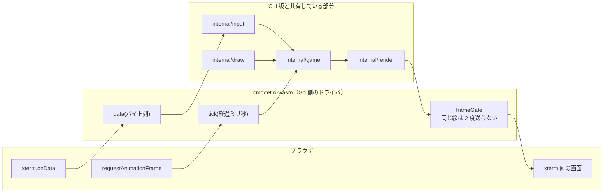

# M2 完了 — ブラウザで遊べるようになった

2026-09-11。GitHub Issue #3 / PR #17。

🎮 https://bubbleshaker.github.io/tetro-term/ （キーボードのある端末向け。タッチは M3）

## 何をしたか

M0 で通した経路の上に、M1 のゲームを載せた。**新しく書いたのはドライバだけ**で、
`internal/` の中身はコアもレンダラもキーの読み替えも、CLI 版とまったく同じものが動く。

**ブラウザ版のドライバは JS と Go の 2 枚でひとつ**になった。CLI 版では 1 つの
`main` が「時間を測る」「キーを読む」「画面へ流す」を全部やっていたが、
ブラウザではそのうち「時間を測る」と「キーを受け取る」が JS 側にある。

## 理解しておくとよい要点

### 1. 時間を測るのは requestAnimationFrame

`time.Ticker` を Go 側に持たせていない。ブラウザでは `setTimeout` が
**背面タブで 1 秒に 1 回まで絞られる**ためである。絞られるだけで止まらないので、
その間の経過時間を素直にコアへ渡すと——コアは「溜まった分だけ落とす」——
タブに戻った瞬間にミノが何段も落ちて、置きたかった場所を通り過ぎている。

`requestAnimationFrame` は背面タブで**止まる**。「見ていない間は時間が進まない」が
そのまま成立する。ゲームとしてもそのほうが正しい。

### 2. それでも上限は要る（100ms のクランプ）

rAF が止まるということは、戻ってきた最初の 1 回の経過時間が数分になりうるという
ことでもある。`clock.go` の `clampDelta` が 100ms で切り詰める。
落下間隔 800ms の 1/8 なので、**1 回の `Update` で落ちるのは高々 1 段**になる。

テストは「定数の大小」ではなく、実際にコアへ 30 秒ぶん渡して**落ちた段数**で確かめている。
守りたいのは定数の関係ではなく結果のほうだからである。

### 3. 同じ絵は 2 度送らない

描画は毎秒 60 回呼ばれるが、絵が変わるのはミノが動いたときだけで、重力に至っては
800ms に 1 回しかない。`screen.go` の `frameGate` が直前のフレームを覚えていて、
同じなら `write` しない。

これは `render` の「差分描画はしない」と矛盾しない。**レンダラは相変わらず毎回
まるごと組み立てる**。同じものを 2 度送らないのはドライバの判断である。
この区別があるので、レンダラのテストは今も文字列の比較だけで書ける。

### 4. テストできない層を、テストできる形に割った

`cmd/tetro-wasm/main.go` は `//go:build js && wasm` なのでホストの `go test` から
見えない。そこで**ブラウザに触らない判断だけをビルドタグの無いファイルに分けた**。

| ファイル | ビルドタグ | 中身 | テスト |
| --- | --- | --- | --- |
| `main.go` | `js && wasm` | `syscall/js` の配線 | 無し（ブラウザで確認） |
| `clock.go` | 無し | 時間をどう進めるか | あり |
| `screen.go` | 無し | いつ画面を送るか | あり |

`func main` の無い `package main` でもホストの `go test` と `go vet` は動く
（`go build ./...` だけは落ちるが、CI はこれを実行していない）。
**「js/wasm だからテストできない」の範囲は、思っているより狭い。**

### 5. 端末は 22x22 固定、収めるのは CSS

FitAddon（画面の広さから桁数を割り出すアドオン）を捨てた。盤面が
10 列 × 20 行で固定である以上、**画面に合わせて桁数を変える道具は逆向き**である。

桁数・行数は Go の `render.Size()` が決めて JS へ渡す。JS 側に 22 という数字は無い。
収めるのは CSS の `transform: scale()` で、倍率は「入れ物に端末の実寸が収まる比」。
`fontSize` を計算する方式にしなかったのは、セル幅と行高の丸めを自分で当てにいくと
**1 桁はみ出す事故**が起きやすいため（実寸は xterm の私有 API を覗かないと取れない）。

### 6. ブラウザに「終了」は無い

`q` と `Ctrl-C` は何もしない。プロセスの終わりが存在しないからである。
`input.Action` が「やめることはゲームのルールではない」と定義している以上、
それをどう解釈するかはドライバの自由で、ブラウザ版は**解釈しないことを選んだ**。

同じ理由で `render.Leave()`（カーソルを戻す）も呼ばない。対で呼べという約束に
反しているが、ブラウザには「出ていく」瞬間がない。

### 7. 抽選を共有の場所へ出した

`randomDraw` が `cmd/tetro` にあり、ブラウザ版にも同じものが要る状態だった。
2 か所に分かれていると **M5（#6）で片方だけ 7バッグになる**事故が起こりうる。
しかもブラウザ版でしか遊んでいなければ、CLI 版が古いままでも気づかない。

`internal/game` の中には置けない。layering の決まりがコアの import を
`fmt` と `time` に限っており、`math/rand` を入れるのは背骨を折ることになる。
`internal/draw` を作った。

## つまずいた点

### この WSL の headless Chromium は rAF を 1 回も回さない

ローカルでブラウザ確認をしようとして、盤面がいつまでも表示されないので実装を疑った。
調べると、**自前で仕込んだ空の rAF ループでも 1 秒間に 0 回**しか発火していなかった。
スクリーンショットも取れない（30 秒でタイムアウトする）。描画ライフサイクルそのものが
回っていない。`--disable-gpu`、swiftshader、`DISPLAY` を外す、CDP の
`Emulation.setVirtualTimePolicy`——どれも効かなかった。ヘッドフルは WSLg で起動に失敗する。

そこで**見た目ではなく、Go が実際に書き出したフレームを捕まえる**方式に変えた。
`globalThis.tetroTerm` への代入を横取りして `write` / `ready` / `gameOver` を包み、
テスト側から `tick(経過ミリ秒)` を直接呼ぶ。production のコードには一切手を入れていない。
これで 31 項目を自動で検証できた（重力・クランプ・移動・回転・GAME OVER・
`q` の無視・4 つの画面サイズでの収まり）。

**rAF ループそのものと ResizeObserver の追従だけは、この方式でも確かめられない。**
そこは Pages で実機確認する。

### 拡縮してから文言を差し替えていた

上の検証で見つかったバグ。狭い画面では操作説明が折り返して行数が増え、その分だけ
端末に使える高さが減る。**倍率を測ってから文言を差し替えていた**ので、
280x500 で盤面が 2% はみ出していた。文言を確定させてから測るようにした。

### 描くより先に ready を呼ぶ必要があった

当初は「`Enter()` → 最初のフレーム → `ready()`」の順で書く仕様にしていた。
ところが JS は `ready` の中で端末をフレームぴったりの大きさに作り替えるので、
先に描いた絵はそのリサイズに巻き込まれうる。しかも**描き直しが来ない**——
次の tick が組み立てるフレームは消える前とまったく同じ絵なので、
`frameGate` が「送る必要なし」と判断してしまう。順序を入れ替えた。

「同じ絵は送らない」という最適化が、別の場所の前提を静かに壊した例である。

### 操作説明が JS 側に複製されていた（レビューで発見）

`web/main.js` は冒頭で「ゲームのルールはここに一切無い。キーが何を意味するかすら
知らない」と宣言しているのに、**キー割り当ての表そのものが JS に書いてあった**。
割り当てを変えても JS は黙って古いまま動き続ける。

`internal/input` に `KeyHelp()` を足し、割り当ての表のすぐ隣に説明を置いた。
`TestKeyHelpDescribesEveryBinding` が「キーを足して説明を忘れる」と
「割り当てを消したのに説明が残る」の両方を見張る。どちらのバグも注入して確かめた。

### ResizeObserver が入れ物しか見ていなかった（レビューで発見）

`#stage` だけを観測していたので、フォントが確定して 1 文字の実寸が決まり直したときに
倍率が古いまま残りうる。端末そのものも観測するようにした。

## 次

**M3**（Issue #4）: タッチ操作ボタン列。**スマホで遊べるようになる**。

キーの意味を知っているのは `internal/input` だけ、という形は M2 で守り切れている。
ただしタッチボタンは「バイト列」ではなく直接「入力」を送りたくなるはずで、
そこで入口側の境界（いまは「バイト列ひとつ」）をどう扱うかが論点になる。
