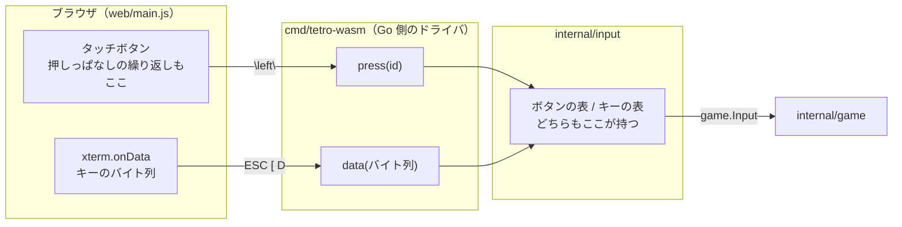

# M3 完了 — スマートフォンで遊べるようになった

2026-09-11。GitHub Issue #4。

🎮 https://bubbleshaker.github.io/tetro-term/

## 何をしたか

画面下にタッチボタンを並べ、指だけで最後まで遊べるようにした。

## 決めたこと

### ボタンはキーのふりをしない

一番迷ったのはここ。「キーボード入力と同じ経路で渡す」を素直に読むと、
`←` ボタンが `\x1b[D`（左矢印キーのバイト列）を作って既存の経路へ流す形になる。
コアへの入口が 1 本のままなので、一見きれいに見える。

採らなかった。**バイト列は端末という入力装置の都合**であって、画面上のボタンには
その都合が無い。ボタンのためにバイト列を組み立てると、「←は ESC [ D」という
`internal/input` だけの持ち物が JS 側にも増える。そのあと割り当てを変えたとき、
JS を直し忘れても**ボタンは動き続ける**——別のキーとして。

代わりに `press(id)` という 2 本目の入口を作った。入口は 2 つになったが、
どちらも `game.Handle(input)` の 1 点に合流するので、操作の解釈は二重にならない。
CONTEXT.md が言う境界は「バイト列」ではなく「入力」だった、という読み直しである。

### ボタンの一覧も Go が配る

寸法（`render.Size`）と操作説明（`input.KeyHelp`）を Go から配っているのと同じ扱いにした。
何個あり・何と書かれ・どちらの親指に置かれ・押しっぱなしで繰り返してよいかを、
すべて `internal/input/touch.go` の表 1 枚が決める。JS が持つのは「押されたら
id をそのまま返す」だけ。

おかげで **M4（ハードドロップ）と M5（ホールド）では JS を触らなくてよくなった**。
表に 1 行足せば、ボタンも読み上げ用の説明も一緒に増える。足し忘れは
`TestEveryKeyInputIsAlsoAButton` が落として教える——キーで押せる操作にボタンが
無ければ、それはスマホでできない操作だからである。

### 押しっぱなしの繰り返しは JS が作る

PLAN.md には「キーを離したイベントは取得できない」と書いてあるが、これは**端末の話**
だった。タッチには `pointerup` があるので、離した瞬間が分かる。スマホで 5 マス
動かすのに 5 回叩かせるのは無理があるので、200ms 待ってから 60ms ごとに繰り返す。

これは CLI 版で OS のキーリピートがやっていることと同じ層の話であり、
ゲームのルールではないので、コアではなくドライバ（JS）側にある。
ただし**どのボタンが繰り返してよいか**は Go が決めている。回転を繰り返させないのは
ボタンの性格であって画面の都合ではないし、ロックディレイ（M4）が入ったとき
「接地したまま回し続けて無限に粘る」を招く布石でもある。

### ソフトキーボードを出させない

実装前に一番危なかったのがこれ。xterm.js のフォーカス先は隠れたテキストエリアなので、
スマホでそこにフォーカスが載ると**画面の下半分がキーボードに占領される**。
`inputmode="none"`（文字入力の口ではあるが画面キーボードは要らない、という指定）と
「指で触られたときはフォーカスを戻さない」の二重で塞いだ。

二重にしたのは、`inputmode` を無視するブラウザがあったとき、片方だけだと
遊べなくなるため。逆に `inputmode` のほうを残してあるのは、タッチ対応 PC で
物理キーボードまで死なせないためである（`inputmode="none"` は物理キーを通す）。

### タッチ端末かどうかは「判定 + 実績」で決める

一発で当てる手段が無い（タッチ対応ノート PC、外付けキーボード付きタブレット）。
粗いポインタを持つ端末（`pointer: coarse`）では最初から出し、そうでなくても
実際に指で触られたらその場で出す。判定だけでは「出ないと遊べない」側へ外れうるし、
実績だけでは最初の 1 タップが操作にならず、開いた人には壊れて見える。
誤って出しても「使わないボタンが並ぶ」だけなので、外すなら出る方へ外す。

## どう確かめたか

Go 側のテストが守れるのはボタンの表までで、そこから先——ボタンが本当に DOM になり、
指で押され、繰り返し、離すと止まるか——は JS の受け持ちになる。
**ここが壊れても PC のキーボードでは最後まで遊べてしまう**ので、気づくのは
スマホを出したときになる。

なので `scripts/check-touch.mjs` を書いた。実機相当の縦画面で実際に指を下ろし、
押しっぱなしにし、ボタンの外へ滑らせて離す。press の呼ばれ方だけでなく、
端末へ流れたフレームの列位置まで見て「押した結果がゲームに届いた」ことを確かめる。

CI には入れていない。Go のリポジトリに node_modules とブラウザを引き込む割に
合わないので、手元で回す道具として置いた。

書いたテストには**バグを注入して、実際に落ちることを確かめた**:
離したときに止める処理を外す／`inputmode` の抑止を外す／タッチでもフォーカスを
戻す、の 3 つで、それぞれ狙ったチェックだけが落ちた。Go 側も同様に、
ボタンの足し忘れ・回転の押しっぱなし・表をそのまま返す、の 3 つを注入して確かめた。

## 残っていること

- ハードドロップのボタン（M4 / #5）とホールドのボタン（M5 / #6）。
  どちらも `internal/input/touch.go` の表に 1 行足すだけで出る。
- リスタート（M7 / #8）。いまゲームオーバーからの行き先はリロードしかない。
